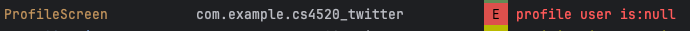

For ProfileScreen:
-----------------------------------------
- I think there may be an issue with the user profile api. I am able to obtain the number of followers, following, etc., however, obtaining the user from the profile returns as null.
- At line 123, I commented out the line that causes this issue. I also logged the user returned by the profile entity and it prints out as null.

- To use the app, please first log in with valid credentials to access the profile screen.
- I can log in with users like 'ben10' and '#1pokemonfan' and I can navigate to profile which loads correctly.
- But I think there may be an issue with the "testuser" user's userID (it's 123). I get an error at line "UUID.fromString(LoggedInUser.loggedInUserId)" saying that testuser has an invalid UUID string after logging in and navigating to the profile.
- I also think there may be an issue with the image URL's from the API's users, it gives me res/bear when I obtain it
- 

- I also added registration functionality. If you click on the text at the bottom, it will change to login button
- to a register one, and a user can successfully register if both text fields are not blank. I used the signup api for this
- I tested it myself with username and password "foo". Then if you navigate to the profile screen, there is a blank profile.

