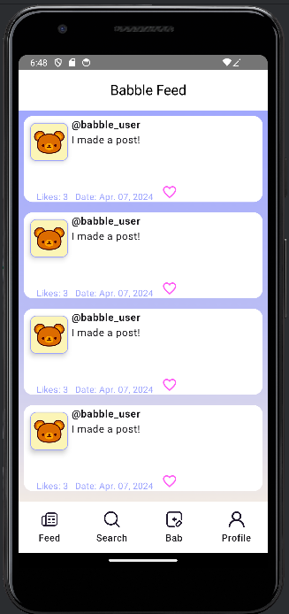

Info on BabFeedScreen
---------------------

I used a Scaffold composable which is split into three parts: a top bar, bottom bar, and floating button.
I removed the floating button but if we decide to add functionality to add a post, this button might be nice to use.

In the body of the Scaffold, I used a lazy column of the same bab card used for the profile.

I also added a nav bar component in the bottom bar of the scaffold. Maybe we can use this
for the other screens too?

I guess the only other thing for this screen would be loading the correct babs, but we need
the database/API for that.

