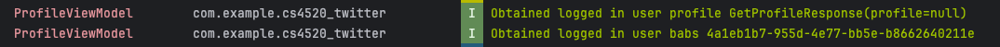

### Error w/ newly registered users navigating to ProfileScreen:
-----------------------------------------
- After the latest profile api update, preexisting users can navigate to profile screen with all the correct information on display.
- There does appear to be a new error now, but only with newly registered users.
- For example, I created a new account with both username and password as "test". This seems to work according to the logs.

- But observing the response in the profile VM, it seems that the profile is returned as null. 

- Then the error that comes with the app crashing is:

- FATAL EXCEPTION: main
  Process: com.example.cs4520_twitter, PID: 5180
  java.lang.NullPointerException: Attempt to invoke virtual method 'com.example.cs4520_twitter.data_layer.database.UserEntity com.example.cs4520_twitter.data_layer.database.UserProfileEntity.getUser()' on a null object reference
  at com.example.cs4520_twitter.composables.ProfileScreenKt$UserProfileScreen$2$1$3$1.invoke(ProfileScreen.kt:132)

### Using the app
-----------------------------------------
- To use the app, please first log in with valid credentials to access the profile screen.
- I can log in with users like 'ben10' and '#1pokemonfan' and I can navigate to profile which loads correctly.

- (More minor) But I think there may be an issue with the "testuser" user's userID (it's 123). I get an error at line "UUID.fromString(LoggedInUser.loggedInUserId)" saying that testuser has an invalid UUID string after logging in and navigating to the profile.
- (More minor) I also think there may be an issue with the image URL's from the API's users, it gives me res/bear when I obtain it. I'm just loading all images with the dummyURL

### Registration page
-----------------------------------------

