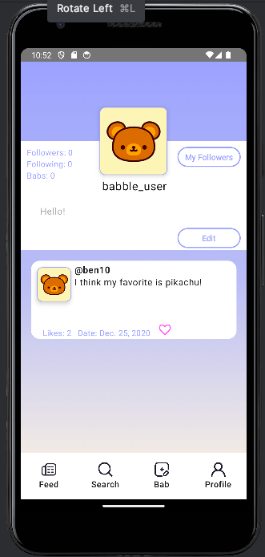
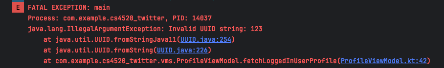

Some comments
-----------------------------------------

- Can I add a method to the User API to retrieve a user?
- To use the app: please first log in with valid credentials to access the profile screen.
- I think there may be an issue with the "testuser" user's userID (it's 123). I get an error at line "UUID.fromString(LoggedInUser.loggedInUserId)" saying that testuser has an invalid UUID string after logging in and navigating to the profile.
- But I can log in with users like 'ben10' and '#1pokemonfan' and I can navigate to profile which loads correctly (aside from the banner username, but I need an api method to retrieve a user).
- I also think there may be an issue with the image URL's from the API's users, it gives me res/bear when I obtain it

