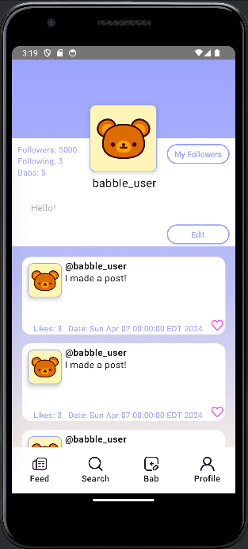
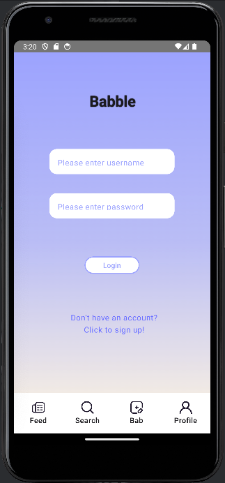

Some comments for reading ProfileScreen.kt
-----------------------------------------

- After pulling from main, MainActivity shouldn't have conflicts now, I think. I added both ProfileScreen and LoginScreen to NavHost.
- Now, when running the app, the login screen gets displayed first with the nav bar at the bottom. You can also navigate to profile screen now using the nav bar.
- I created a new resource folder for composables, so the Bab card, ProfileScreen, and LoginScreen should be there now.
- Also deleted the old datatypes for Thomas' datatypes.

