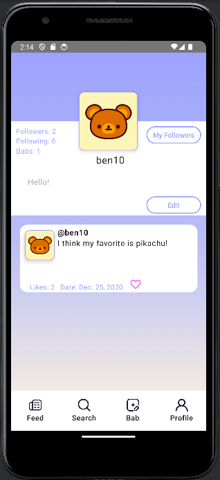

### Using the app
-----------------------------------------
- To use the app, please first log in with valid credentials to access the profile screen.
- I can log in with users like 'ben10' and '#1pokemonfan' and I can navigate to profile which loads correctly.

- (More minor) But I think there may be an issue with the "testuser" user's userID (it's 123). I get an error at line "UUID.fromString(LoggedInUser.loggedInUserId)" saying that testuser has an invalid UUID string after logging in and navigating to the profile.
- (More minor) I also think there may be an issue with the image URL's from the API's users, it gives me res/bear when I obtain it. I'm just loading all images with the dummyURL

### Registration page
-----------------------------------------

BabFeedScreen
---------------------

ProfileScreen
-----------------------------------------

