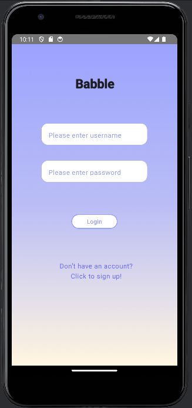
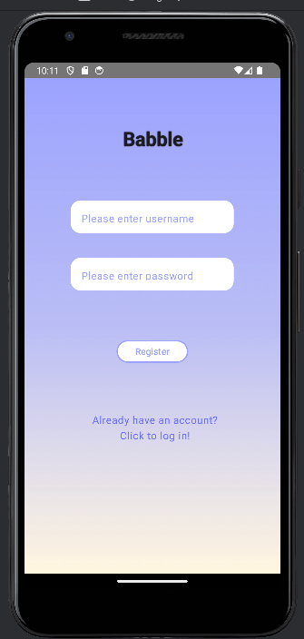
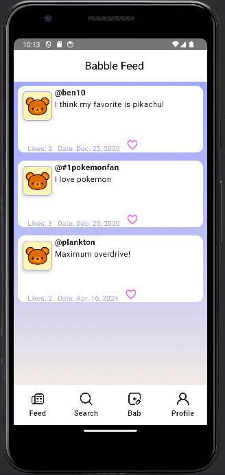
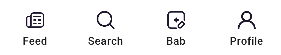
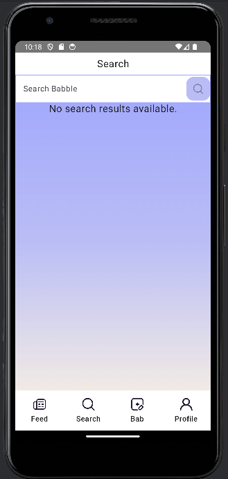
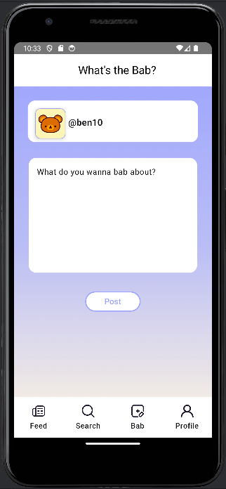
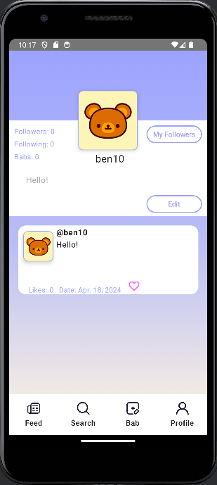

Github repository Link: https://github.com/tomgrbz/cs4520-FinalProject
API Link: https://github.com/tomgrbz/cs4520-backend-api

### How to run the app
-----------------------------------------
- Upon opening the application, you will be shown the log in screen. 

- Either log in with valid credentials (you can use "ben10" as the username and "qwerty" as the password)
 or register a new account by clicking on the "Click to sign up!" text.

  

  

- After logging in, you will be automatically navigated to the bab feed screen.

### Bab Feed Screen
-----------------------------------------
- This feed screen should show a random number of babs from random users.
- Bab posts have the user information, with the number of likes and date.
  

### Navigation Bar
-----------------------------------------
- At the bottom of all screens beside login is the navigation bar.
- Using this, you can navigate to the feed, add a bad, profile, and search screens.
  

### Search Screen
-----------------------------------------
- To search for specific babs, enter some criteria in the search field. You can search babs by username (e.g "ben10") or by specific keywords/substring in bab posts.

  

### Add Bab Screen 
-----------------------------------------
- To use this screen, first enter a nonempty string in the text field and click the post button

### Profile Screen
-----------------------------------------
- The profile screen shows the logged in user's information, including their posts. There are also two buttons:
- One with "my followers" to navigate to the my followers screen.
- Another with "edit" to navigate to the edit screen.

### Edit Screen
-----------------------------------------
- This screen allows you to change the user's username or profile description.
- Enter the new text and then click on the save button. To return to the profile, click the 'return to profile' button.

